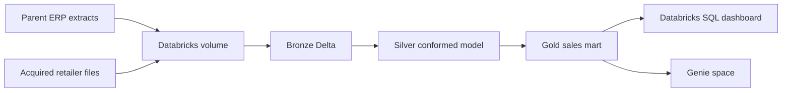

# FMCG Acquisition Lakehouse on Databricks

An end-to-end portfolio project that consolidates two FMCG retailers after an acquisition. The parent company sends ERP-style CSV extracts, while the acquired company lands daily files with different column names and business keys. Databricks standardizes both sources into a governed Medallion lakehouse and publishes a sales mart for SQL dashboards and Genie.

> This is an original educational implementation inspired by the business scenario in the Codebasics video linked by the learner. It does not redistribute the creator's restricted dataset or source code. All included data is synthetic.

## Architecture



## What this demonstrates

- Batch ingestion from two structurally different sources
- Bronze, Silver, and Gold Delta tables
- Explicit schemas, audit metadata, and quarantine records
- Customer and product key mapping after an acquisition
- Full load plus idempotent incremental `MERGE`
- Data-quality expectations and pipeline audit logging
- Databricks Workflows configuration
- SQL dashboard queries and Genie-ready semantic descriptions
- Unit-testable business rules and synthetic sample data

## Repository layout

```text
fmcg-databricks-lakehouse/
├── databricks.yml
├── resources/fmcg_job.yml
├── src/fmcg_lakehouse/{config.py,quality.py}
├── notebooks/
│   ├── 00_setup.py
│   ├── 01_bronze_ingestion.py
│   ├── 02_silver_dimensions.py
│   ├── 03_silver_orders.py
│   ├── 04_gold_sales_mart.py
│   └── 05_incremental_load.py
├── sql/{dashboard_queries.sql,genie_instructions.md}
├── data/sample/{parent_company,acquired_company}/
├── scripts/generate_sample_data.py
└── tests/test_sample_data.py
```

## Data model

| Layer | Tables | Purpose |
|---|---|---|
| Bronze | `parent_*_raw`, `acquired_*_raw` | Raw source values plus ingestion metadata |
| Silver | `dim_customer`, `dim_product`, `fact_order`, `quarantine_orders` | Conformed keys, types, deduplication, validation |
| Gold | `sales_mart`, `daily_sales`, `product_performance` | Dashboard-ready business measures |

`gross_sales = quantity * unit_price` and `net_sales = gross_sales * (1 - discount_pct)`.

## Run in Databricks Free Edition

1. Create a GitHub repository and push this folder.
2. In Databricks, create a Git folder and clone the repository.
3. Create a Unity Catalog volume such as `/Volumes/workspace/fmcg_lakehouse/landing`.
4. Upload the contents of `data/sample` to that volume, preserving its folders.
5. Open `notebooks/00_setup.py` and set the widgets if you need different catalog, schema, or volume names.
6. Run notebooks `00` through `04` in order for the initial load.
7. Add files beneath an `incremental` source folder and run `05_incremental_load.py`.
8. Create a workflow manually from the notebooks, or deploy the included bundle after changing the workspace host in `databricks.yml`.
9. Use `sql/dashboard_queries.sql` in Databricks SQL to build visualizations.

Databricks source notebooks use `# COMMAND ----------` separators and can be imported directly.

## GitHub portfolio checklist

- Replace `YOUR_NAME` in `pyproject.toml` and update the repository URL.
- Add screenshots of successful workflow runs and dashboard tiles under `docs/screenshots/`.
- Record your own design decisions and challenges in this README.
- Never commit access tokens, secret scopes, cloud keys, or real customer data.

## Local verification

The Spark pipeline runs on Databricks. The included local tests validate the synthetic input contracts without Spark:

```bash
python scripts/generate_sample_data.py
python -m unittest discover -s tests -v
```

## Design decisions

- Source-specific normalization happens before unioning datasets.
- Enterprise keys are deterministic hashes, so reruns do not create new identities.
- Bad fact rows are quarantined instead of silently discarded.
- Incremental ingestion uses file metadata and Delta `MERGE` for replay safety.
- Secrets are referenced by scope/key only; no credentials exist in the repository.

## License

MIT for the code. The synthetic sample data is released under CC0-1.0.
